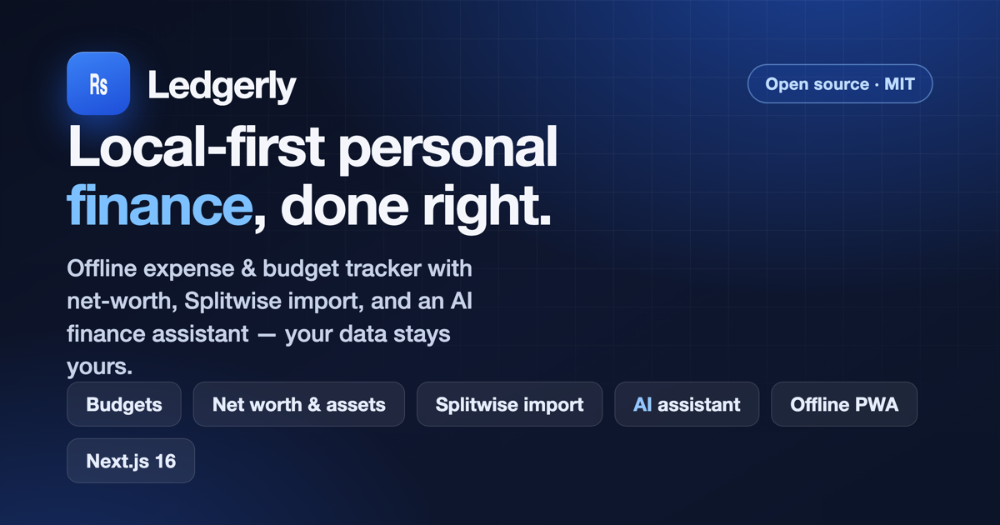
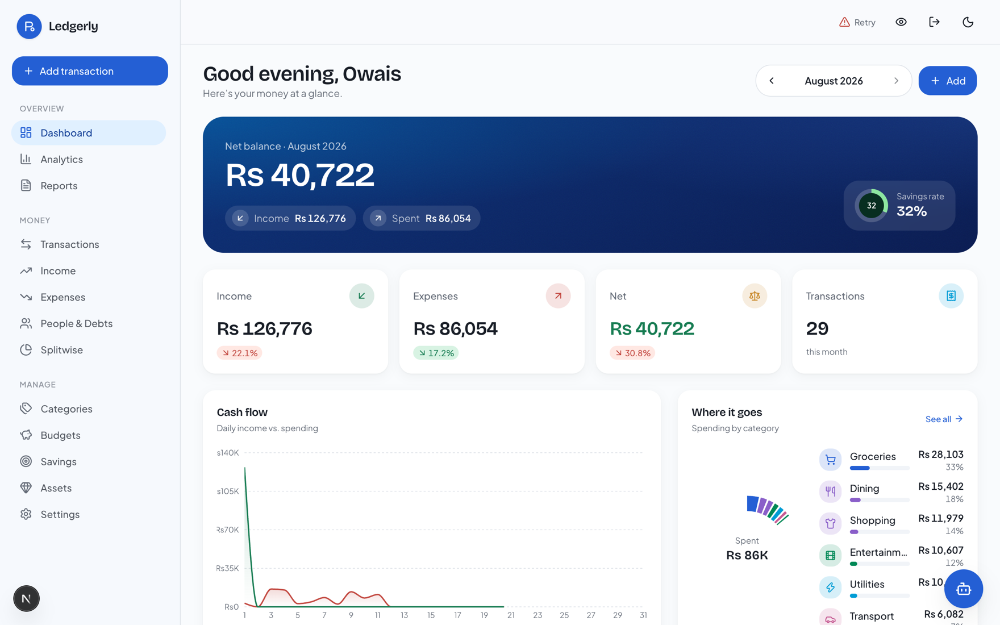
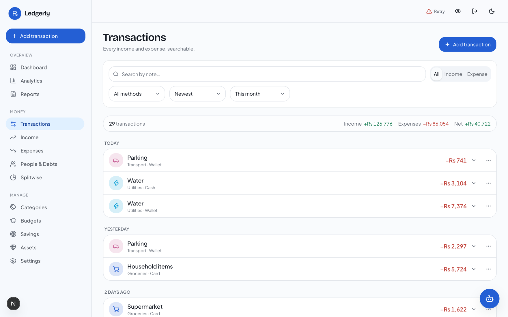
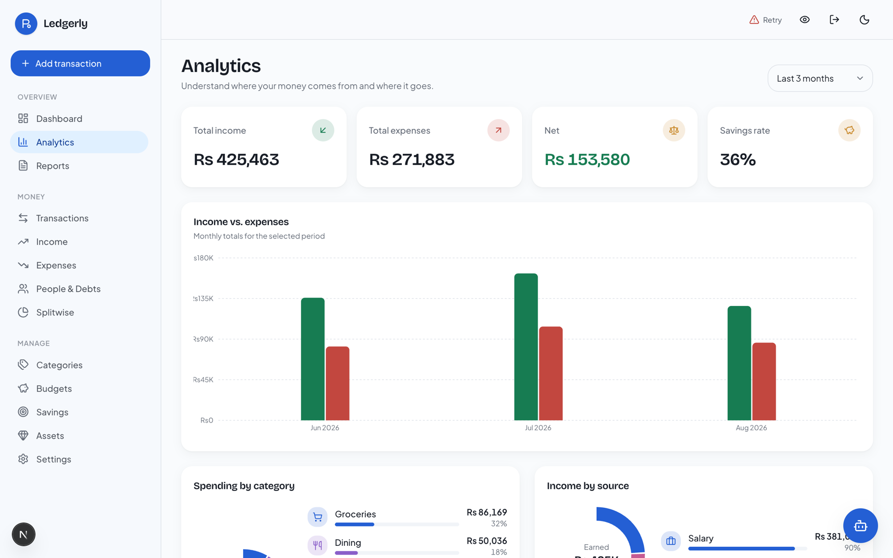
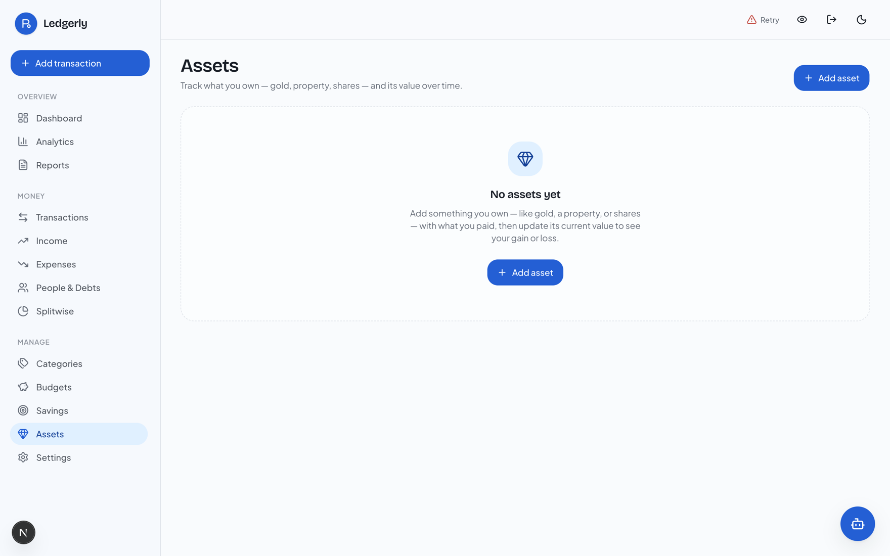
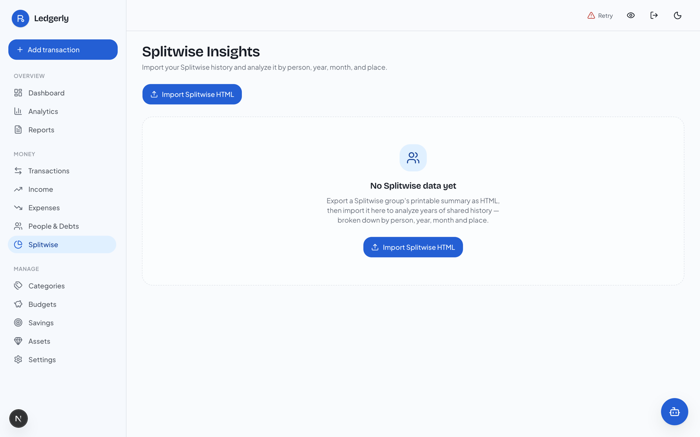
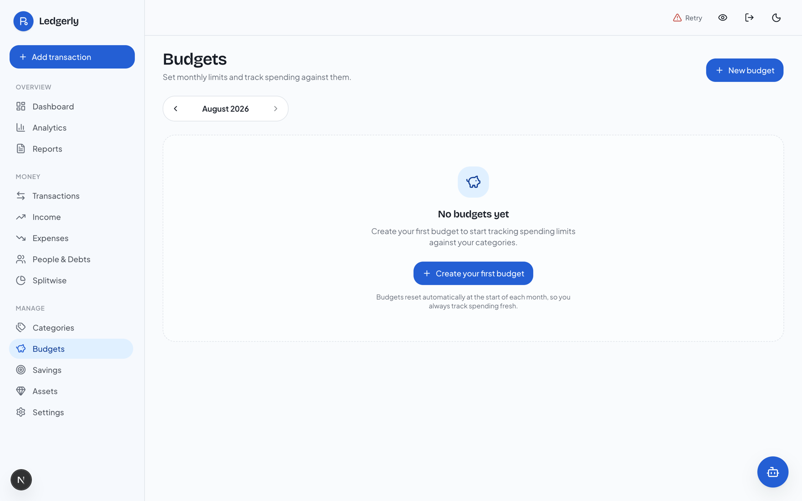
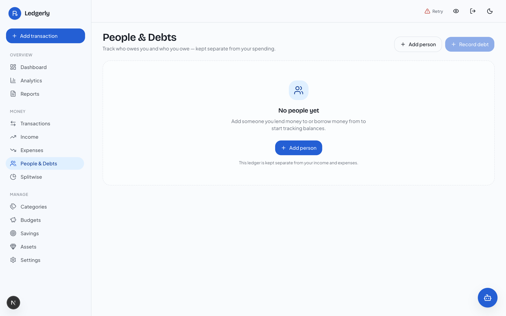

<div align="center">



# 💸 Ledgerly — Open-Source, Local-First Personal Finance & Expense Tracker

### A private, offline-first money manager with an AI finance assistant, asset & net-worth tracking, budgets, savings goals, debt splitting, and Splitwise import — built with Next.js 16, React 19 & TypeScript.

**Own your money data.** No ads, no data-selling, no bank connections, no third-party cloud. **Self-host your own instance** — you sign in to *your* server, your data lives in your browser first, and sync (optional) goes only to *your own* database.

[](LICENSE)
[](https://nextjs.org)
[](https://react.dev)
[](https://www.typescriptlang.org)
[](https://tailwindcss.com)
[](#-offline--installable-pwa)
[](#-contributing)

**[Features](#-features) · [Why Ledgerly](#-why-ledgerly) · [Quick Start](#-quick-start) · [AI Assistant](#-ai-finance-assistant) · [Deploy](#-deploy-to-vercel) · [FAQ](#-faq) · [Keywords](#-keywords)**

</div>

---

> **TL;DR** — Ledgerly is a **free, open-source, self-hostable expense tracker and budgeting app** (a privacy-first **Mint / YNAB / Splitwise alternative**) that runs **100% offline as a PWA**. It tracks income, expenses, budgets, savings goals, **assets & net worth** (gold, silver, stocks, crypto, property, cash with **live price rates**), and **who owes whom**. It can **import your Splitwise history**, read **receipts and PDF statements**, and includes a **built-in AI finance assistant** you can chat with to add transactions and answer money questions in plain English.

---

## ✨ Features

### 💰 Core money management
- **Dashboard** — net balance, savings rate, cash-flow trend, spending breakdown, budgets, debts, and savings goals for any month, at a glance.
- **Income & Expense tracking** — fast quick-add, per-ledger views, categories, payment methods, notes, and trends.
- **Transactions ledger** — searchable & filterable (text, type, category, method, amount, date range) with inline edit/delete + **undo**, virtualized for thousands of records.
- **Categories** — create, recolor, re-icon, archive, and safely delete with transaction reassignment.
- **Budgets** — monthly overall & per-category limits with live progress and near-/over-limit warnings.
- **Savings goals** — set targets, log contributions/withdrawals, and watch each goal fill up.
- **Multi-currency** — pick your currency; understands **lac / crore / k** shorthand on input.

### 🤖 AI finance assistant *(optional, free)*
- Chat in plain English: *“add ₨5,000 salary”*, *“how much can I still spend this month?”*, *“what did I spend on food in July?”*
- **Reads and writes** across the app — add/edit transactions, set budgets, log savings, record assets & debts — with a **confirm step before any write**.
- Understands **receipts and PDF statements** (drop in an image/PDF → it extracts the expense).
- **Scope-guarded** to your finances only, powered by Google **Gemini** (generous free tier). Bring your own API key.

### 🪙 Assets & net worth
- Track **gold, silver, stocks, crypto, property, and cash** with cost basis, current value, and **gain/loss**.
- **Live rates** for gold & silver and FX via free, no-key public APIs — or set values manually.
- See your **true net worth** = assets − debts + balances, updated as prices move.

### 👥 People, debts & Splitwise
- **People & Debts** — track money you **lent or borrowed**, log repayments, and see per-person balances with a dedicated **per-person history page**.
- **Splitwise import** — bring in **years** of Splitwise history from an exported summary, reconciled to exact balances, with **Insights** by person, year, month, and place.

### 🔒 Privacy, offline & sync
- **Local-first** — data lives in your browser (IndexedDB); the app works fully **offline**.
- **Blur-amounts privacy toggle** — hide every number instantly (reveal on focus) for shoulder-surfing safety.
- **Account sign-in** — email + password via [Better Auth](https://better-auth.com), with an optional per-user **4-digit PIN** quick-unlock validated server-side. Multi-tenant, with an admin role and a closed (allowlist/invite) sign-up.
- **Optional two-way sync** — last-write-wins sync to **your own** Neon Postgres, authenticated by your session. Nothing goes to any third party — ever.
- **Import/export** — JSON backup/restore + CSV transactions import/export.
- **Installable PWA** with auto-update, plus **light + dark** themes and full **accessibility**.

> Every screen ships **loading, empty, success, and error** states and is fully **responsive**.

---

## 🎯 Why Ledgerly?

| | **Ledgerly** | Typical cloud finance app |
|---|:---:|:---:|
| Your data stays on **your device** | ✅ Local-first | ❌ On their servers |
| Works **fully offline** | ✅ PWA | ❌ Needs connection |
| **No bank credentials** required | ✅ Manual & import | ❌ Screen-scrapes your bank |
| **Self-hostable / free** | ✅ MIT, deploy your own | ❌ Subscription |
| **Own your sync database** | ✅ Your Neon Postgres | ❌ Their cloud |
| **AI assistant** | ✅ Built-in, BYO key | ⚠️ Paid tier |
| **Assets + net worth + live prices** | ✅ | ⚠️ Varies |
| **Splitwise import** | ✅ | ❌ |

**Ledgerly is for you if** you want a **privacy-first, ad-free, open-source alternative to Mint, YNAB, Splitwise, or a spreadsheet** — one you fully control and can host yourself.

---

## 📸 Screenshots

> Shown with built-in **sample data** — your real numbers stay on your device.

<p align="center">
  
</p>

<table>
  <tr>
    <td width="50%"><br/><sub><b>Transactions</b> — fast, searchable, filterable ledger</sub></td>
    <td width="50%"><br/><sub><b>Analytics</b> — trends, donuts &amp; insights</sub></td>
  </tr>
  <tr>
    <td width="50%"><br/><sub><b>Assets</b> — net worth, cost basis &amp; live gain/loss</sub></td>
    <td width="50%"><br/><sub><b>Splitwise</b> — import history &amp; insights</sub></td>
  </tr>
  <tr>
    <td width="50%"><br/><sub><b>Budgets</b> — monthly limits with live progress</sub></td>
    <td width="50%"><br/><sub><b>People &amp; Debts</b> — track who owes whom</sub></td>
  </tr>
</table>

---

## 🚀 Quick Start

**Requirements:** Node **24+** (Next.js 16 does not run on older Node).

```bash
git clone https://github.com/codewithowais/expense-tracker.git
cd expense-tracker
npm install
cp .env.example .env    # then edit .env (see table below)
npm run dev
```

### Environment (`.env`)

Ledgerly uses [Better Auth](https://better-auth.com) accounts on a Postgres database you control, so the four core vars below are required. The AI assistant is optional.

| Variable | Purpose |
| --- | --- |
| `DATABASE_URL` | Neon/Postgres **pooled** connection string (`npx neonctl@latest init`). Holds the Better Auth tables and the per-user synced ledger. **Required.** |
| `BETTER_AUTH_SECRET` | Session-signing secret. **Required.** Generate: `node -e "console.log(require('crypto').randomBytes(32).toString('base64'))"` |
| `BETTER_AUTH_URL` | The canonical origin the app is served from — `http://localhost:3000` in dev, your domain in prod. |
| `ADMIN_EMAIL` | The email that becomes the **super-admin** on sign-up (manages the signup allowlist / invites). This makes *you* the owner of your instance. |
| `GEMINI_API_KEY` | Google Gemini API key (`AIza…`) to enable the AI assistant. Free from [Google AI Studio](https://aistudio.google.com/apikey). Leave blank to hide the assistant. |

Then create the database tables (one-time):

```bash
node scripts/migrate.mjs --fresh        # app tables (user-scoped sync_records)
npx @better-auth/cli@latest migrate     # Better Auth tables (user/session/account)
```

Open **http://localhost:3000**, **sign up** with your `ADMIN_EMAIL` (you become the admin of your own instance), then complete a short setup (name, currency, optional PIN, optional sample data).

> **Self-hosting note:** sign-up is **closed by default** — only the `ADMIN_EMAIL`, allow-listed emails, or valid invites can register. This keeps *your* instance private to *you* (and anyone you invite).

> 🔐 **Security:** treat `DATABASE_URL` and `BETTER_AUTH_SECRET` as secrets. Never commit them — keep them in `.env` (git-ignored) and your host's dashboard. If a secret leaks, rotate it immediately.

---

## 🤖 AI Finance Assistant

Ledgerly ships an in-app assistant that turns natural language into financial actions:

- **Read tools:** financial summary, net worth, list/filter transactions, category breakdown, spending trend, budgets, debts, savings, assets.
- **Write tools:** add/edit/delete transaction, add asset, update asset value, set budget, add savings goal & contribution, add debt — **each write asks you to confirm first.**
- **Receipts & PDFs:** attach an image or statement and it extracts the amount, category, and date.
- **Big-number aware:** understands *“1 lac”*, *“2.5 crore”*, *“5k”*.

It's **strictly scoped to personal finance** and refuses off-topic requests. Uses Google Gemini's free tier — just add `GEMINI_API_KEY`.

> **Privacy note:** on Google's **free** Gemini tier, prompts may be used to improve their models. For maximum privacy, leave the key unset (the assistant simply won't appear) or use a paid, no-retention tier.

---

## 🧱 Tech Stack

- **Next.js 16** (App Router, typed routes, Turbopack) · **React 19** · **TypeScript** (strict)
- **Tailwind CSS v4** (OKLCH tokens) + **shadcn/ui** (Radix)
- **Dexie / IndexedDB** for local-first persistence · **`@neondatabase/serverless`** for sync
- **Zustand** (UI/lock/sync state) · **dexie-react-hooks** (reactive queries)
- **Recharts 3** · **Motion** · **date-fns** · **react-hook-form** + **Zod** · **Sonner** · **next-themes**
- **unpdf** (serverless PDF text extraction) · **Google Gemini** (AI) · **Vitest** (unit tests)

---

## ☁️ Deploy to Vercel

Ledgerly is a standard Next.js App Router app and deploys to **Vercel** with **zero extra config** (no `vercel.json`).

1. Push to GitHub and **Import** the repo in Vercel (framework auto-detected as Next.js).
2. In **Project → Settings → Environment Variables**, add the vars from the table above for **Production** (and **Preview**). The local `.env` is git-ignored and never uploaded:
   - `DATABASE_URL` — the **pooled** Neon string. **Required** for accounts & sync.
   - `BETTER_AUTH_SECRET` — the session-signing secret. **Required** (same value across all instances).
   - `BETTER_AUTH_URL` — your deployed origin, e.g. `https://your-app.vercel.app`.
   - `ADMIN_EMAIL` — the email that becomes the super-admin on sign-up.
   - `GEMINI_API_KEY` — enables the AI assistant; unset = assistant hidden.
3. Run the migrations once against your production `DATABASE_URL` (see [Quick Start](#-quick-start)).
4. Deploy. Changing an env var later requires a **redeploy** to take effect.

<sub>Also runs anywhere Node 24 does — see the Docker section below.</sub>

---

## 📴 Offline & Installable (PWA)

Ledgerly ships a service worker ([`src/app/sw.js/route.ts`](src/app/sw.js/route.ts)) and a web manifest, so it **installs like a native app** and keeps working with no connection:

- **Online:** network-first for pages/assets (always the latest), written back to cache.
- **Offline:** the same requests fall back to cache; immutable build assets (`/_next/static/*`) are served cache-first.
- **Offline writes** save straight to IndexedDB and **queue for sync**; when you're back online, they push to Neon automatically (also on tab refocus + a periodic safety net).
- API routes (`/api/lock`, `/api/sync`) are **never cached** and fail gracefully offline.

The worker registers in **production only** (it would fight HMR in `next dev`) and **auto-updates** on load/refocus. Test with `npm run build && npx next start`.

---

## 🐳 Run with Docker

A multi-stage [`Dockerfile`](Dockerfile) pinned to **Node 24** builds and runs identically regardless of host Node, using Next.js standalone output for a small image.

```bash
docker compose up --build
# → http://localhost:3000
```

- **Server-only** vars (`DATABASE_URL`, `APP_PIN`, `GEMINI_API_KEY`, `SYNC_SECRET`) are read at **runtime** — pass with `--env-file .env` (compose uses `env_file`).
- `NEXT_PUBLIC_*` vars are inlined at **build time**, so `NEXT_PUBLIC_SYNC_TOKEN` is a **build arg** (wired in `docker-compose.yml`).

---

## 🧪 Scripts

```bash
npm run dev        # start the dev server
npm run build      # production build
npm run typecheck  # tsc --noEmit
npm run lint       # eslint
npm run test       # vitest (money / analytics / dates / debts / savings / csv logic)
```

---

## 🏗️ Architecture

Data is **local-first**: everything lives in IndexedDB via a single typed Dexie instance, accessed **only** through repositories (`src/lib/repositories/*`). The UI reads reactively via hooks in `src/lib/hooks/use-data.ts`, so any mutation instantly refreshes every view. When `DATABASE_URL` is set, a background sync engine mirrors changes to Neon using soft-delete tombstones and **last-write-wins**.

```
src/
  app/(app)/        # authed shell + feature routes (dashboard, transactions,
                    #   budgets, savings, people, assets, analytics, reports, splitwise…)
  app/api/          # sync + lock + assistant + rates + extract server routes
  components/
    assistant/      # AI chat widget
    assets/         # asset tracker + live-rate button
    splitwise/      # import + insights
    people/ transactions/ charts/ categories/ budgets/ savings/ reports/ settings/ sync/
    ui/             # shadcn primitives
  lib/
    db/             # Dexie schema + seed (per-user namespaced)
    repositories/   # settings, categories, transactions, budgets, people, savings, assets, splitwise, meta
    assistant/      # tools, executors, chat hook
    splitwise/      # parser, report builder, types
    sync/           # sync engine + types
    rates.ts analytics.ts debts.ts savings.ts   # pure derivations
```

Money is stored in major units; aggregation is float-safe. See [`docs/ARCHITECTURE.md`](docs/ARCHITECTURE.md) for the full component and API surface.

---

## 🔐 Privacy

All data lives in **your browser** by default. Cloud sync is **opt-in** and goes only to **your own** Neon database via server-side API routes — the connection string is never exposed to the browser. Use **Settings → Data** to export a backup, and **Settings → Cloud sync** to enable syncing across devices. The AI assistant is optional and only runs when you provide your own key.

---

## 🤝 Contributing

Contributions are welcome! To get started:

1. **Fork** the repo and create a branch: `git checkout -b feat/your-feature`.
2. Run `npm run typecheck && npm run lint && npm run test` before pushing.
3. Open a **Pull Request** describing the change.

Found a bug or have an idea? **[Open an issue](../../issues)** — ⭐ **star the repo** if Ledgerly is useful to you, it genuinely helps others discover it.

---

## 📄 License

Released under the **[MIT License](LICENSE)** © 2026 Owais Ahmed. Free to use, modify, self-host, and distribute — just keep the license notice.

---

## 🔎 Keywords

<sub>
open source expense tracker · personal finance app · budgeting app · local-first · offline PWA finance app · self-hosted money manager · privacy-first budget tracker · Mint alternative · YNAB alternative · Splitwise alternative · Splitwise import · net worth tracker · asset tracker · gold price tracker · crypto portfolio tracker · savings goal tracker · debt tracker · who owes whom · AI finance assistant · Gemini finance chatbot · receipt scanner · PDF statement parser · Next.js 16 finance app · React 19 · TypeScript · Tailwind CSS v4 · IndexedDB · Dexie · Zustand · Neon Postgres sync · multi-currency expense tracker · PIN lock · installable PWA · money management software · income and expense tracker · cash flow dashboard
</sub>

---

## ❓ FAQ

<details>
<summary><strong>What is the best open-source, self-hosted expense tracker?</strong></summary>

Ledgerly is a strong choice: it's a **free, open-source, self-hosted personal finance and budgeting app** you deploy on your own server and database. It's **local-first** (works offline as a PWA), tracks income, expenses, budgets, savings, **net worth and assets**, and **who owes whom**, imports **Splitwise** history, and includes an optional **AI finance assistant** — with **no ads and no data-selling**.
</details>

<details>
<summary><strong>Is there a free, offline budgeting app that isn't tied to a bank?</strong></summary>

Yes — Ledgerly is a **free offline budgeting app** that never connects to your bank. It runs as an installable PWA, stores data locally in your browser, and lets you add transactions manually, by CSV import, by receipt/PDF scan, by Splitwise import, or by chatting with the AI assistant.
</details>

<details>
<summary><strong>Is Ledgerly free and open source?</strong></summary>

Yes. Ledgerly is **100% free and open source** under the **MIT license**. You can use it, modify it, self-host it, and even build commercial products on top of it.
</details>

<details>
<summary><strong>Is my financial data private? Where is it stored?</strong></summary>

By default, **all your data stays in your browser** (IndexedDB) and never leaves your device. Cloud sync is **opt-in** and goes only to **your own** Neon Postgres database. Ledgerly has no central server that collects your data.
</details>

<details>
<summary><strong>Does it work offline?</strong></summary>

Yes — Ledgerly is an **installable PWA** that works **fully offline**. Changes you make offline are saved locally and synced automatically when you reconnect (if you enabled sync).
</details>

<details>
<summary><strong>Is Ledgerly a good Mint, YNAB, or Splitwise alternative?</strong></summary>

Yes. It covers budgeting and expense tracking (like **Mint/YNAB**) **and** shared/lent-money tracking (like **Splitwise**) — plus it can **import your Splitwise history**. Unlike those apps, it's **local-first, private, self-hostable, and free**.
</details>

<details>
<summary><strong>Do I need to connect my bank account?</strong></summary>

**No.** Ledgerly never asks for bank credentials. You add transactions manually, via the AI assistant, receipt/PDF import, CSV import, or Splitwise import.
</details>

<details>
<summary><strong>How does the AI assistant work and is it private?</strong></summary>

It uses **Google Gemini** with **your own** API key (free tier available). It can read and write your finance data (with a confirm step for writes) and is scoped to finance only. On Google's free tier, prompts may be used to improve their models — for maximum privacy, leave the key unset or use a no-retention tier.
</details>

<details>
<summary><strong>Can it track assets and net worth (gold, stocks, crypto)?</strong></summary>

Yes. Track **gold, silver, stocks, crypto, property, and cash** with cost basis, current value, and gain/loss. Gold/silver and FX can use **live public price APIs** (no key needed) or manual values, and your **net worth** updates as prices move.
</details>

<details>
<summary><strong>What tech stack does it use?</strong></summary>

**Next.js 16, React 19, TypeScript, Tailwind CSS v4, Dexie/IndexedDB, Zustand, Recharts, and optional Neon Postgres** for sync. It deploys to **Vercel** with zero config or runs anywhere via **Docker**.
</details>
